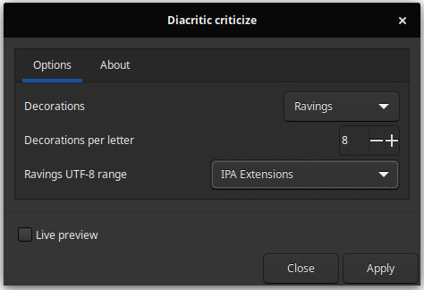

##DiacriticCriticize - artistic explorations of the UTF-8

DiacriticCriticize is, for now, an [Inkscape](https://inkscape.org/en/) extension providing one transformative experience 
of the known and usual text. It changes any text into random characters or decorated originals using two UTF-8-based approaches.
Primarily, it is  used for breaking the mold of the usual text-based decorations.

###Installation and basic usage
As with any Inkscape extension, the easiest way it to copy both *diacritic_criticize.inx* and *diacritic_criticize.py* in the
extensions folder, where Inkscape could find them. On Linux it is usually in *usr/share/inkscape/extensions/* while on 
Windows it is in the Inkscape install folder, under *share/incsape/extensions*.

The extension will appear in the Extensions menu under Text. When chosen, the extension options widnow will pop up.

Please note that the effects would be applied only on selected text in the main Inkscape canvas. The default option for
decorations is *Diacritics*, while *Ravings* and *Diacritic ravings* are also available. *Decorations per letter* are only
used for diacritics.

###Diacritic decorations
This effect is commonly known as "zalgo" text, a glitchy text effect based on adding the combinig characters from the UTF-8 range 
from 0x0300 to 0x036F. These characters are known as combining characters or diacritics and, when printed, they don't take up the character
space, but are combined with the previous character. That way we can randomly choose and print any number of diacritics on
each of the selected word's letters. Thus the effect adds random marks on each letter when applied.

###Explorative randomness
This effect (*Ravings* in the *Decorations* dropdown) acts as a letter-by-letter substitution engine, but using arbitrary 
UTF-8 ranges. For now, only the [IPA Extensions](https://en.wikipedia.org/wiki/IPA_Extensions) range is enabled (0x0250 - 0x02AF)
giving the random phonetic alphabet sign letter-for-letter.

The last options is to combine both effects (*Diacritic ravings*).

###Todos

- [ ] Include more UTF-8 ranges for *Ravings*
- [ ] Enable the choice of ranges (like [here](https://www.utf8-chartable.de/unicode-utf8-table.pl))